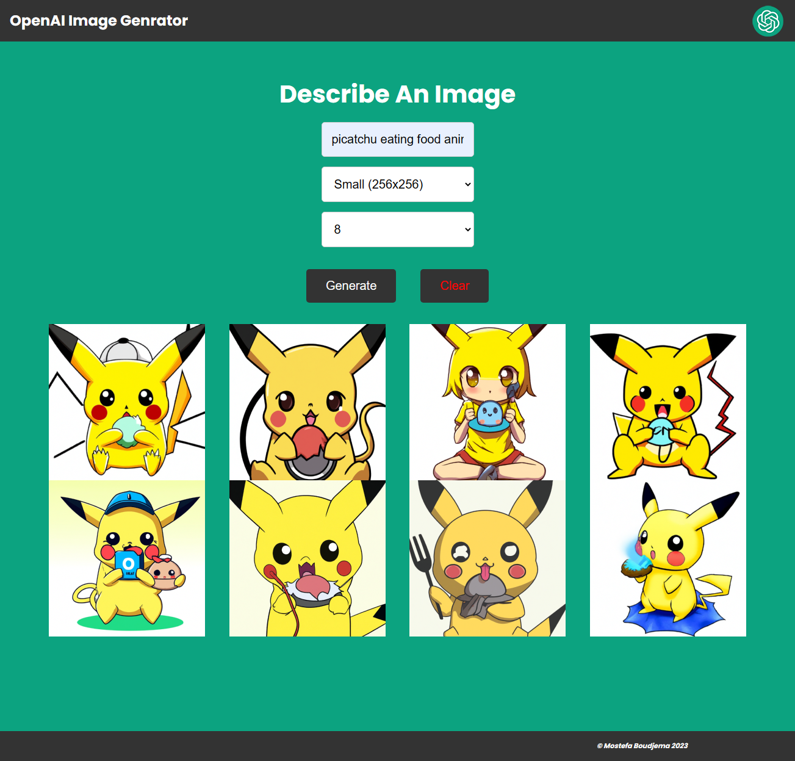

# my-app

## Project setup
```
npm install
```

### Compiles and hot-reloads for development
```
npm run serve
```

### Compiles and minifies for production
```
npm run build
```

### Lints and fixes files
```
npm run lint
```

### Customize configuration
See [Configuration Reference](https://cli.vuejs.org/config/).


# OpenAI Image Generator

This is a simple image generator built with Vue3 that uses [OpenAI's Dall-E models](https://beta.openai.com/docs/guides/images) to generate images.



## Usage

Rename the `.env.example` file to `.env`.

Generate an API KEY at [OpenAI](https://beta.openai.com/) and add it to the `.env` file.

Install the dependencies

```bash
npm install
```

Run server

```bash
npm start
```

Visit `http://localhost:8080` in your browser.

The endpoint is at `POST http://localhost:8080/openai/generateimage`.
